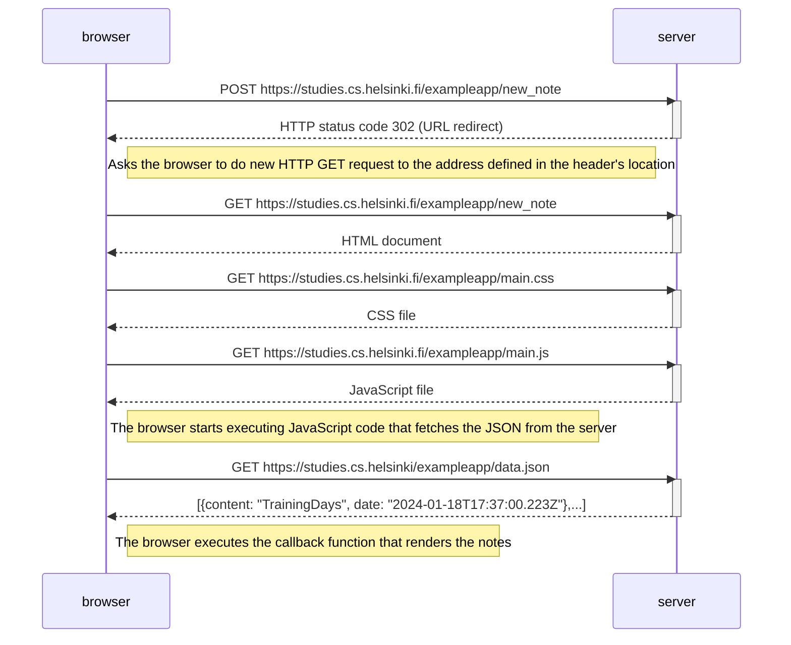

```mermaid
sequenceDiagram
	participant browser
	participant server

	browser->>server: POST https://studies.cs.helsinki.fi/exampleapp/new_note
	activate server
	server-->>browser: HTTP status code 302 (URL redirect)
	deactivate server

	Note left of server: Asks the browser to do new HTTP GET request to the address defined in the header's location

	browser->>server: GET https://studies.cs.helsinki.fi/exampleapp/new_note
	activate server
	server-->>browser: HTML document
	deactivate server
	
	browser->>server: GET https://studies.cs.helsinki.fi/exampleapp/main.css
	activate server
	server-->>browser: CSS file
	deactivate server
	
	browser->>server: GET https://studies.cs.helsinki.fi/exampleapp/main.js
	activate server
	server-->>browser: JavaScript file
	deactivate server

	Note right of browser: The browser starts executing JavaScript code that fetches the JSON from the server

	browser->>server: GET https://studies.cs.helsinki/exampleapp/data.json
	activate server
	server-->>browser: [{content: "TrainingDays", date: "2024-01-18T17:37:00.223Z"},...]
	deactivate server

	Note right of browser: The browser executes the callback function that renders the notes
```

