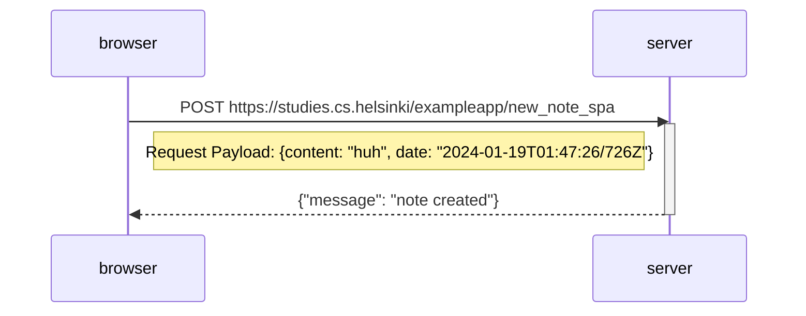

```mermaid
sequenceDiagram
	participant browser
	participant server

	browser->>server: POST https://studies.cs.helsinki/exampleapp/new_note_spa
	activate server
	Note right of browser: Request Payload: {content: "huh", date: "2024-01-19T01:47:26/726Z"}
	server-->>browser: {"message": "note created"}
	deactivate server
```
